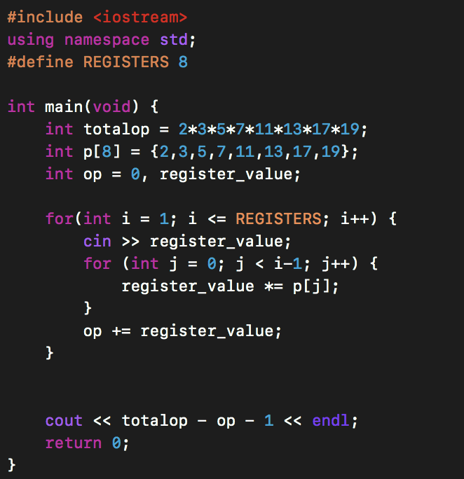

## Lab 01

Here is a pdf version of the ppt I covered during the lab. And the codes that I (skimmed through) / (demonstrated live).

  [content.pdf](https://sidhant007.github.io/CS2040C/lab01/content.pdf) (The pdf version of the ppt shown)

  [vectors.cpp](https://sidhant007.github.io/CS2040C/lab01/vectors.cpp) (in-built functions of vectors and algorithms)

  [strings.cpp](https://sidhant007.github.io/CS2040C/lab01/strings.cpp) (in-built functions of strings and algorithms)

  [istringstream.cpp](https://sidhant007.github.io/CS2040C/lab01/istringstream.cpp) (based on istringstream)

  [register.cpp](https://sidhant007.github.io/CS2040C/lab01/register.cpp) (My solution to the REGISTER problem)

Challenge Questions - 

Q) Given a string, check if it is a palindrome or NOT without using any kind of loops / goto / recursive statements.

  
Solution

   Use reverse(s.begin(), s.end()), where s is the string.

Q) Given a list of names, how would you sort these names in alphabetical order ?

  
Solution

  Push all the names as strings in a vector<string> V, then use sort(V.begin(), V.end())

Q) Try to do the REGISTER question using the mathematical approach, which we discussed in the lab.

  
Solution

  
  The above code is written by Srivastave Aaryam (one of the students)

