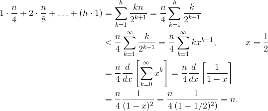

# Lab 04

  [Feedback form](https://docs.google.com/forms/d/e/1FAIpQLScLeIezAu3Bueokx98FzaNraoK_90lxMd6trBRnnNLXKQjojg/viewform?usp=sf_link) (Please fill this form, to give feedback about this lab)

Here is a pdf version of the ppt I covered during the lab. And the codes that I (skimmed through) / (demonstrated live).

  [content.pdf](https://sidhant007.github.io/CS2040C/lab04/content.pdf) (The pdf version of the ppt shown) 

  [STLPriorityQueue.cpp](https://sidhant007.github.io/CS2040C/lab04/STLPriorityQueue.cpp) (The STL Priority Queue implementation)

  [UVa 1203.cpp](https://sidhant007.github.io/CS2040C/lab04/UVa1203.cpp) (The solution code for the problem <a href = "https://uva.onlinejudge.org/external/12/1203.pdf">Uva 1203</a> discussed in the lab which involves the use of Priority Queue)

## Challenge Questions - 

Q) For PS2 D, try to code your priority queue using pointers instead of using an array based approach.

  
Solution

  TBA

Q) Given an array of N integers, find the Kth smallest element in time complexity O(N + KlogN) ?

(Note - Sorting will not work) 

(Note - We do not want a randomised solution, so do not think along the lines of n_th element function in the C++ library)

  
Solution

  Make your own min binary heap / priority queue using the demo code shown in Lab05. You would need to build the heap in O(N), which is done by inserting the elements in a weird fashion.

  Step 1 - Take the unsorted array and put them into the binary heap in any arbitrary order.

  Step 2 - Do for(i = heapSize; i >= 1; i--) shiftDown(i);
   
  i.e Basically do shiftDown for the deepest node, then 2nd deepst and so on, untill you hit the root. 
  
  Step 3 - The heap is now a valid heap you are done.

  Explanation - 

  The step 2 is the essence of the build. First let us make this claim - 

  Claim 1 - Given a subtree of heap with the root of the subtree as node "a" and it has two children, left child named as "b", right child named as "c". Then if b and c are valid subtree heaps, i.e within the subtrees of "b" and "c" the properties of heap are satified. Then this subtree of "a" will also be a valid heap, given we do a single shiftDown(a) operation. Let val[a], val[b], val[c] denote the values at the indices a, b and c respectively.

  Proof - 

  Case 1 - When val[a] > max(val[b], val[c]) - The subtree heap of "a" is already valid, so shiftDown(a) does nothing.

  Case 2 - When val[a] < max(val[b], val[c]) - Arbitrarily assume, that val[b] > val[c]
  
  Then "a" will be swapped with "b" during the shiftDown(a) operation. And the shiftDown(a) operation will recursively call the same operation for shiftDown(b), but now do notice that after the swap, value[b] = value[a]. So in this scenario we are ensured that the "a" would become a valid subtree heap provided "b" becomes a valid subtree heap. This is basically solving the same problem again, but for a smaller subtree. This will true, using PMI(Principal of Mathematical Induction) on this claim. 

  So now, we have proven Claim 1 and understand why the heap will result to be sorted after Step 2. But what about the time complexity. 

  Well carefully observe, let the depth of the tree be called as "h" <= log2(N), then - 

  The number of nodes at height h are N/2.
   
  The number of nodes at heigh h - 1 are N/4
   
  In general the number of nodes at height x are N/2^(h - x + 1)

  Let n(x) denote the number of nodes at height x.
  So we have n(x) = N / 2^(h - x + 1)

  Now the sum of time complexity because of the ShiftDown due to all the nodes at height h is = n(h) * 0

  We multiply with 0, because they are not moved at all, and they remain at their location when shiftDown is called for them.

  Similarly , what is the sum of time complexity for all nodes at height h - 1. It is n(h - 1) * 1.

  More generally let S(x) denote the sum of time complexity because of shifting down all the nodes at height x. Then 

  S(x) = n(x) * (h - x + 1)

  So we need to find sum over S(x) from x = 1 to h. 

  So time complexity = S(1) + S(2) + ... + S(h) 
  
  = n(1) * h + n(2) * (h - 1) + ... + n(h) * 0
  
  = 1 * h + 2 * (h - 1) + 4 * (h - 2) + ... + N/2 * 0

  = 0 * N/2 + 1 * N/4 + 2 * N/8 + ... + (h - 2) * 4 + (h - 1) * 1 + h * 1 (Reversing the expression)

  = (0 * N)/2 + (1 * N)/4 + (2 * N)/8 + ... 

  This sum is then bounded by O(N) using Taylor series. The notation of math requires is pretty extensive so I will just add this image below. You can also read this build O(N) function [here at stack overflow](https://stackoverflow.com/questions/9755721/how-can-building-a-heap-be-on-time-complexity)

  

Q) We know that a Priority Queue is internally implemented using a max heap. For PS2 D, a lot of you implemented your own "max heap" and the general approach was that each node should have "2 children". That is why it is known as "binary heap". But let us say we make a "ternary heap", i.e in this heap each node will have 3 children each. Then what will be the time complexity per push() and per erase() ? Would this be better than the binary heap in any aspect (time / space / ... ) ?

Or you can try to calculate the time complexity for a  more generic version of a "k-ary heap" where each node has "k children".

  
Solution

  TBA

Q) A kattis like question - 

Given an array of N elements where all of them are initially equal to 1. You are now given Q operations where each operation is either of the 3 types - 

Type 1 - Take the largest element of the array and multiply it by x, where (1 <= x <= 100000)

Type 2 - Take the largest element of the array and divide it by x, where (1 <= x <= 100000) (This division is NOT integer division, it is NORMAL division, so 5 / 2 = 2.5)

Type 3 - Print "Yes" if the (largest element of the array is > 2 * second largest element of the array). Otherwise print "No"

Assume 1 <= N <= 100000, 1 <= Q <= 100000

For Type 1 and Type 2 operations, in case of tie you are allowed to pick arbitrarily.

Also do note, that if you implement this naively in C++, you will experience overflow in int/longlong. And using Python for the bigInteger is NOT the expected solution.

  
Solution

  TBA

